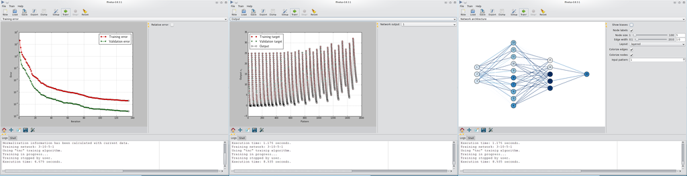

======================================================
Feed-forward neural network for python (ffnet/ffnetui)
======================================================

:Author: :ref:`Marek Wojciechowski <mwojc>`
:Version: `0.8.3 <http://sourceforge.net/projects/ffnet/files/ffnet/0.8.3>`_
:License: `LGPL-3 <https://opensource.org/licenses/LGPL-3.0>`_ / `GPL-3 <https://opensource.org/licenses/GPL-3.0>`_

Welcome to ffnet documentation pages!

**ffnet** is a fast and easy-to-use feed-forward neural network training library for python. It is acommpanied with graphical user interface called **ffnetui**.

.. toctree::
    :maxdepth: 1

    news
    overview
    download
    install
    apidoc
    examples
    screenshots
    development
    cite
    mwojc
    acknowledgements

..
    Indices and tables
    ==================

    * :ref:`genindex`
    * :ref:`modindex`
    * :ref:`search`

.. |SOURCEFORGE| image:: http://sflogo.sourceforge.net/sflogo.php?group_id=126615&type=8
    :target: http://sourceforge.net

.. |SUPPORT| image:: http://images.sourceforge.net/images/project-support.jpg
    :target: http://sourceforge.net/donate/index.php?group_id=182429