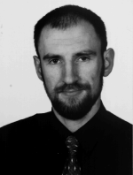

.. title:: Marek Wojciechowski

:Name:
    Marek Wojciechowski
:Position:
    associate researcher
:Affiliation:
    Technical University of Lodz, Department of Civil Engineering, Architecture and Environmental Engineering, Chair of Geotechnics and Engineering Buildings, Al. Politechniki 6, 90-024 Lodz (Poland)
:E-mail:
    mwojc at p.lodz.pl
:Recent publications:
    [1] Marcin Koniorczyk, Marek Wojciechowski, "Influence of salt on desorption isotherm and hygral state of cement mortar - modeling using neural networks", Construction and Building Materials 2009, 23: 2988-2996

    [2] Marek Wojciechowski "Feed-forward neural network as a tool for solving nonlinear differential equations", Proceedings of CMM-2009 - Computer Methods in Mechanics, 18-21 May 2009, Zielona Gora, Poland

    [3] M. Lefik, M. Wojciechowski, "Computational tools based on artificial neural networks for analysis of composite materials", Proceedings of AI-METH 2003 - Methods Of Artificial Intelligence, T. Burczynski, W. Cholewa, W. Moczulski, AI-METH 2003, November 5-7, Gliwice, 2003